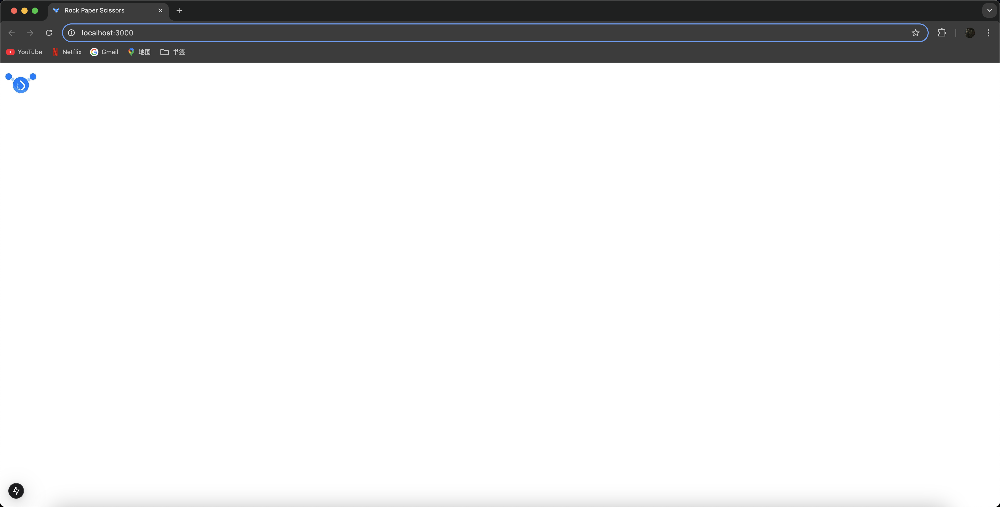
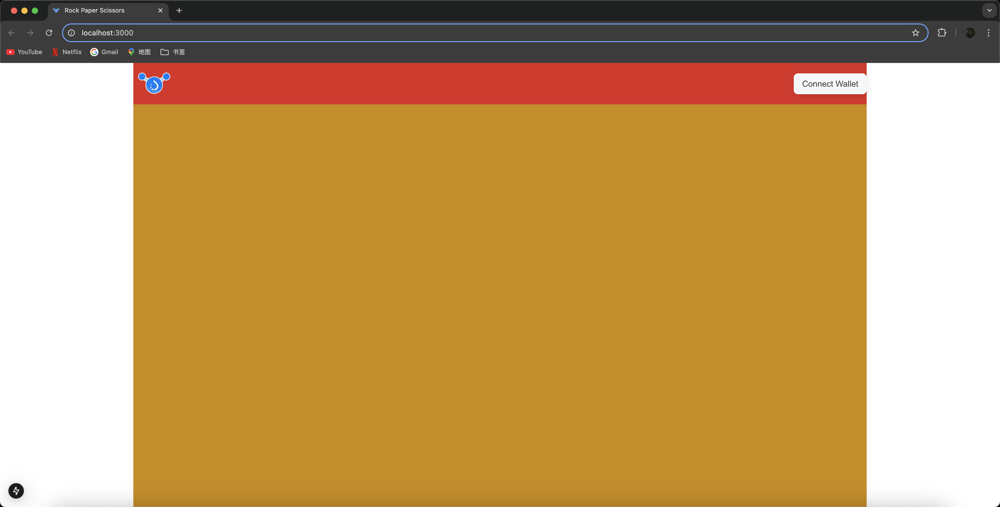
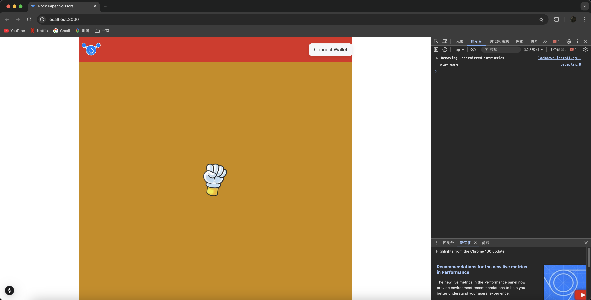
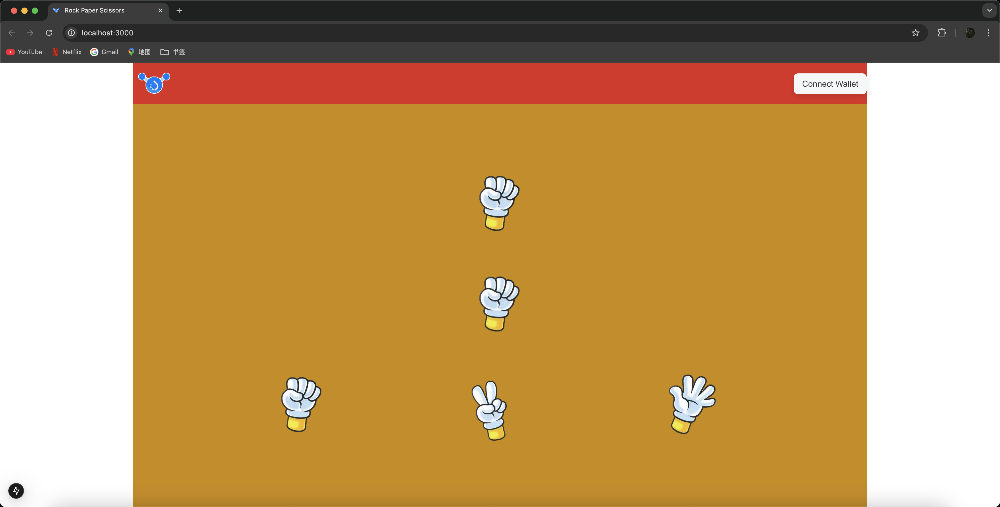
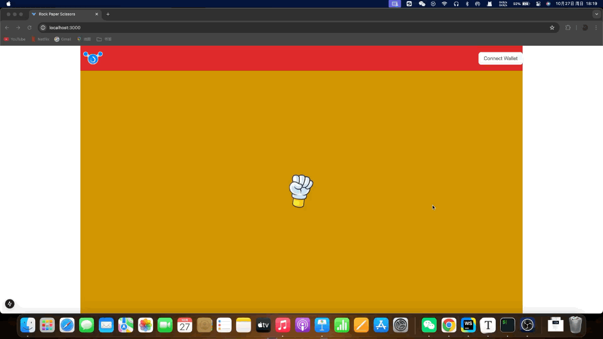
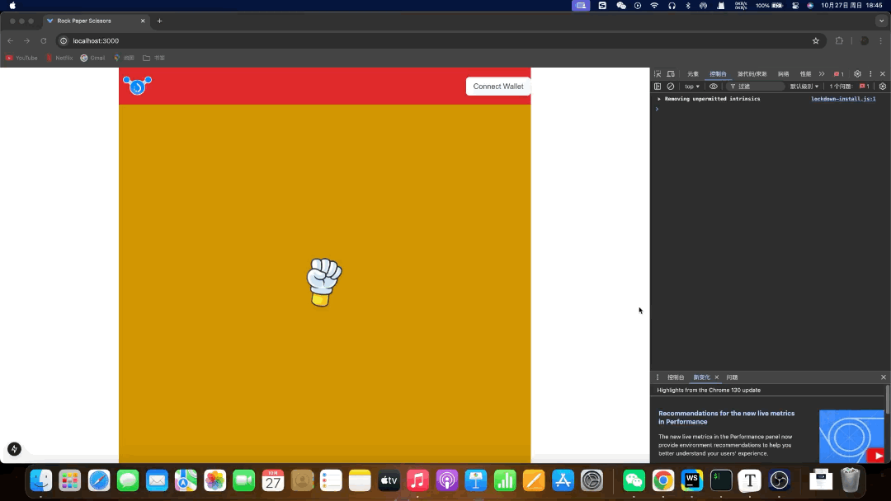
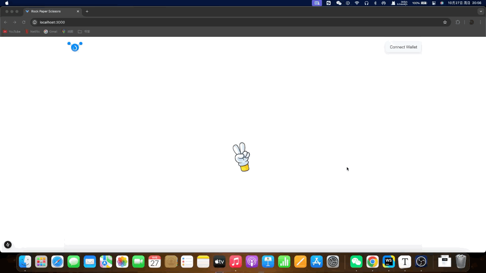

# rock-paper-scissors

## 前端（样式布局）

### 初始化

用 Sui dApp 项目生成器创建一个使用 Sui Testnet 的 Next.js 框架，一切按照提示进行，前文有详细操作流程，这里就不再赘述。

`config/index.ts`是根据你所选择的网络环境进行初始化配置的文件，我们这里不需要动它。<br>`contracts`文件夹用来存储智能合约，`lib/contracts`文件夹用来存储前端对链上合约的调用，`public`文件夹用来存储静态文件，`utils`文件夹用来存储通用的函数或工具，清空这些文件夹里生成的样板代码（直接删除`ts`文件）。<br>`app`文件夹是网页的主体，我们也来对其做一些样板代码清理工作。首先，删除`favicon.ico`，这是网页标签页的图标，然后，进入`page.tsx`，将里面的代码除了基础结构外全部清除，就像这样：

```tsx
'use client'

import Image from 'next/image'

export default function Home() {
    return (
        <div className="">
            <Image src="/logo/logo.jpg" alt="Sui Logo" width={80} height={40} />
        </div>
    );
}

```

准备好HOH社区的logo，将其替换掉`/logo/logo.jpg`，接下来更改`app/layout.tsx`文件中的`metadata`，该结构中的参数会影响网页标签页的展示内容：

```tsx
export const metadata: Metadata = {
    title: "Rock Paper Scissors",
    description: "Classic Game: Rock Paper Scissors",
    icons: "/logo/logo.jpeg"
};
```

在 Next.js 中，使用`public`文件夹中的静态文件的时候，直接用`/`来表示`public/`，上面的`<Image src="/logo/logo.jpg"... />`也是同理。

最后，简单了解一下`app`下的其它内容：`fonts/`、`fonts.ts`、`globals.css`是创建 Next.js 框架时自带的字体样式（处理）和全局`css`样式（已配置好`tailwindcss`），`providers.tsx`用来初始化 Sui 网络环境、钱包等配置。

至此，我们运行项目，应该能得到如下界面：



### 页面搭建

#### 整体布局

- 页面上方一条导航栏，左侧放logo，右侧放连接钱包的按钮。
- 剩余部分都用来作为石头剪刀布的游戏区域。

得益于 Sui dApp 项目生成器的配置，连接钱包的按钮就只需要调用`@mysten/dapp-kit`中提供的组件`ConnectButton`。

为了让布局更直观，我们暂时为上下两块区域加上背景颜色：

```tsx
'use client'

import Image from 'next/image'
import {ConnectButton} from "@mysten/dapp-kit";

export default function Home() {
    return (
        <div className="flex flex-col h-screen mx-64">
            <div className="bg-red-600 flex justify-between items-center">
                <Image src="/logo/logo.jpeg" alt="HOH Logo" width={80} height={80} priority={true} />
                <ConnectButton />
            </div>
            <div className="flex-1 bg-yellow-600"></div>
        </div>
    );
}

```



#### 游戏区域布局

寻找石头、剪刀、布的图片，存储至`public/game/`目录下，分别以`rock.png`、`scissors.png`、`paper.png`命名，以其中任意一张作为样本，将其放到游戏区域的中央，这将作为游戏开始的点击按键，同时为其绑定触发函数：

```tsx
const playGame = () => {
    console.log('play game');
}

<div className="relative flex-1 bg-yellow-600">
    <div className="absolute top-1/2 left-1/2 -translate-x-1/2 -translate-y-1/2 cursor-pointer" onClick={playGame}>
        <Image src="/game/rock.png" alt="start button" width={100} height={100} priority={true} className="w-auto h-auto" />
    </div>
</div>
```



在这个开始按键的上方，是敌方（链上随机）选择区域；下方则是我方（鼠标点击）选择区域。类似的，用`flex`规划好区域后往里面填充内容：

```tsx
<div className="relative flex-1 bg-yellow-600">
    <div className="absolute top-1/2 left-1/2 -translate-x-1/2 -translate-y-1/2 cursor-pointer" onClick={playGame}>
        <Image src="/game/rock.png" alt="start button" width={100} height={100} priority={true} className="w-auto h-auto" />
    </div>
    <div className="absolute top-0 left-0 w-full h-1/2 flex justify-evenly items-center">
        <Image src="/game/rock.png" alt="enemy" width={100} height={100} priority={true} className="w-auto h-auto" />
    </div>
    <div className="absolute bottom-0 left-0 w-full h-1/2 flex justify-evenly items-center">
        <Image src="/game/rock.png" alt="rock" width={100} height={100} priority={true} className="w-auto h-auto" />
        <Image src="/game/scissors.png" alt="scissors" width={100} height={100} priority={true} className="w-auto h-auto" />
        <Image src="/game/paper.png" alt="paper" width={100} height={100} priority={true} className="w-auto h-auto" />
    </div>
</div>
```



这时我们发现，中间的开始按钮失去了作用，仔细观察不难发现，这是因为后续的敌我双方的布局覆盖在了上方，最简单的办法是将开始按钮的代码向下移或者为其自定义`z-index`属性。

之后，我们来思考一个逻辑，开始按钮和后续的出拳选择是否真的需要同时出现？

我们完全可以先将出拳选择区域隐藏，在点击开始后再让其显现出来，相对应的，开始按钮则需要在点击后隐藏。不难发现，它们的显隐状态归根结底都由一个数据进行控制 —— 是否开始游戏。

`const [isPlaying, setIsPlaying] = useState<boolean>(false);`

用一个布尔值`isPlaying`来判断，点击后通过`setIsPlaying`将其设为真。<br>对于需要根据该值隐藏的内容，通过`className={"..." + (isPlaying ? "..." : "...")}`来设置。<br>为了消失和显现不那么突然，可以增加`transition-opacity`来实现渐隐渐显效果。

```tsx
export default function Home() {
    const [isPlaying, setIsPlaying] = useState<boolean>(false);

    const playGame = () => {
        setIsPlaying(true);
    }

    return (
        <div className="flex flex-col h-screen mx-64">
            <div className="bg-red-600 flex justify-between items-center">
                <Image src="/logo/logo.jpeg" alt="HOH Logo" width={80} height={80} priority={true}/>
                <ConnectButton/>
            </div>
            <div className="relative flex-1 bg-yellow-600">
                <div
                    className={"absolute top-1/2 left-1/2 -translate-x-1/2 -translate-y-1/2 z-10 transition-opacity " + (isPlaying ? "opacity-0" : "cursor-pointer opacity-100")}
                    onClick={!isPlaying ? playGame : () => {
                    }}>
                    <Image src="/game/rock.png" alt="start button" width={100} height={100} priority={true}
                           className="w-auto h-auto"/>
                </div>
                <div className={"transition-opacity " + (isPlaying ? "opacity-100" : "opacity-0")}>
                    <div className="absolute top-0 left-0 w-full h-1/2 flex justify-evenly items-center">
                        <Image src="/game/rock.png" alt="enemy" width={100} height={100} priority={true}
                               className="w-auto h-auto"/>
                    </div>
                    <div className="absolute bottom-0 left-0 w-full h-1/2 flex justify-evenly items-center">
                        <Image src="/game/rock.png" alt="rock" width={100} height={100} priority={true}
                               className="w-auto h-auto"/>
                        <Image src="/game/scissors.png" alt="scissors" width={100} height={100} priority={true}
                               className="w-auto h-auto"/>
                        <Image src="/game/paper.png" alt="paper" width={100} height={100} priority={true}
                               className="w-auto h-auto"/>
                    </div>
                </div>
            </div>
        </div>
    );
}
```



类似的，我们为我方选择区域的三个图添加点击事件，由于它们都是`<Image ... />`，可以通过同一个类型的点击事件进行获取，最后通过`alt`属性来区分究竟选择的是石头、剪刀还是布。

```tsx
const clickChoose = (e: MouseEvent<HTMLImageElement>) => {
    console.log(e.currentTarget.alt);
}

<div className="absolute bottom-0 left-0 w-full h-1/2 flex justify-evenly items-center">
    <Image src="/game/rock.png" alt="rock" width={100} height={100} priority={true}
           className={"w-auto h-auto " + (isPlaying ? "cursor-pointer" : "")}
           onClick={isPlaying ? clickChoose : () => {
           }}/>
    <Image src="/game/scissors.png" alt="scissors" width={100} height={100} priority={true}
           className={"w-auto h-auto " + (isPlaying ? "cursor-pointer" : "")}
           onClick={isPlaying ? clickChoose : () => {
           }}/>
    <Image src="/game/paper.png" alt="paper" width={100} height={100} priority={true}
           className={"w-auto h-auto " + (isPlaying ? "cursor-pointer" : "")}
           onClick={isPlaying ? clickChoose : () => {
           }}/>
</div>
```



游戏区域的布局是完成了，我们可以把之前用来辨别区域的背景去掉，纯白色太刺眼，就再加一点点灰色缓冲，但是，为什么开始按钮是石头？不如让它动起来，循环切换石头、剪刀、布，包括敌人（链上随机）在返回结果时也不应该固定显示。

大致思路：将三张图片的文件名放到一个数组中，通过不断加一再对数组长度取余使得下标达成循环，根据当前下标所对应的文件名进行显示渲染。

在`utils`文件夹下创建三个文件`sleep.ts`、`next.ts`、`index.ts`。

`sleep.ts`：顾名思义，让程序睡眠，等待多少时间后再继续向下运行。

```ts
export default function sleep(ms: number) {
    return new Promise(resolve => setTimeout(resolve, ms));
}
```

`next.ts`：在一个数组中循环不断地取下一个。

```ts
// 这里显示标注返回值中依次的类型，方便解构赋值后按照次序获得确切的类型
export default function next<T>(index: number, array: T[]): [number, T] {
    const len = array.length;
    index = (index + 1) % len;
    return [index, array[index]];
}
```

`index.ts`：将`utils`目录下所有导出的东西归档再一同导出，方便其它地方导入。由于这里只有两个函数，便捷性提升得不明显。

```ts
import sleep from './sleep';
import next from './next';

export {
    sleep,
    next
}
```

回到`page.tsx`，借助上面的两个小函数来实现每隔一小段时间切换图片的功能：

1. 图片名更新要实时作用到页面中，所以需要`useState`来创建一个字符串以及改变该字符串的函数：<br>`const [loopName, setLoopName] = useState<string>("rock");`
2. 定义一个下标，表示当前循环到了数组中的哪一项，很自然地想到用`let index = 0;`不过，用`let`定义的变量，除非放到全局，否则每次渲染都会重置。<br>类似于`useState`，有一个钩子函数`useRef`可以解决这个问题：`const index = useRef<number>(0);`<br>当需要取值时，用`index.current`，需要更改值时，也只需要将新值赋值给`index.current`。
3. 定义一个包含三张图片名的数组：`const array = ["rock", "scissors", "paper"];`
4. 实现一个异步函数，在里面依次调用上面两个小工具，获得数据进行更新，而这个函数则放到`useEffect`当中，这个`useEffect`的依赖项设置为`loopName`，即每次`loopName`改变后重新执行。

```tsx
const waitToDispatch = async () => {
    await sleep(222);
    const [ne_idx, name] = next(index.current, array);
    index.current = ne_idx;
    setLoopName(name);
}
useEffect(() => {
    waitToDispatch().then();
}, [loopName]);

// 最后，将写死的<Image src="/game/rock.png" ... />改为<Image src={`/game/${loopName}.png`} ... />
// 每次loopName变化，src也会跟着变化
```

至此，功能已经实现且能够正常运行，不过，如果尝试`build`会发现其中还有一些警告，接下去来尝试解决一下：

`useEffect`中用到了`waitToDispatch`，提示我们最好将其添加为依赖项，于是：`useEffect(..., [loopName, waitToDispatch])`

再次`build`获得一个新的警告，由于`waitToDispatch`是`useEffect`的依赖项，所以它当前定义实现的位置，可能会因为重新渲染等因素出现潜在的问题。提示了两个解决方案，一个是转移实现`waitToDispatch`的位置，另一个是用`useCallback`包裹它。<br>用`useCallback`实现的函数，它不会因为页面重新渲染而改变，除非它检测到它的依赖项发生变化才会更新其中的逻辑，起到缓存、提升性能的作用。<br>于是，我们用其包裹：

```tsx
const waitToDispatch = useCallback(async () => {
    await sleep(222);
    const [ne_idx, name] = next(index.current, array);
    index.current = ne_idx;
    setLoopName(name);
}, [index, array]);
```

我们知道，`array`内部的值其实是不会改变的，所以只需要依赖`index`变化来变化就可以，实际上项目也可以运行，不过又会在`build`时警告，所以我们将其加上。不过，加上之后，又报了个新的`warning`，说是由于`array`是`useCallback`的依赖项，当前位置可能会出现潜在的问题，需要我们转移`array`定义的位置，或者用`useMemo`将其包裹。<br>`useMemo`和`useCallback`类似，但是，`useMemo`得到的是经过逻辑运算后的值，并将这个值缓存下来，以避免重复进行（大量的）逻辑运算，除非它的依赖项的值发生了变化才会重新进行计算。<br>于是，我们用其包裹：`const array = useMemo(() => ["rock", "scissors", "paper"], []);`

终于，我们解决了所有警告！附上当下`page.tsx`的完整代码以及演示动图：

```tsx
'use client'

import Image from 'next/image'
import {ConnectButton} from "@mysten/dapp-kit";
import {MouseEvent, useCallback, useEffect, useMemo, useRef, useState} from "react";
import {sleep, next} from "@/utils"

export default function Home() {
    const [isPlaying, setIsPlaying] = useState<boolean>(false);

    const playGame = () => {
        setIsPlaying(true);
    }

    const clickChoose = (e: MouseEvent<HTMLImageElement>) => {
        console.log(e.currentTarget.alt);
    }

    const [loopName, setLoopName] = useState<string>("rock");
    const index = useRef<number>(0);
    const array = useMemo(() => ["rock", "scissors", "paper"], []);
    const waitToDispatch = useCallback(async () => {
        await sleep(222);
        const [ne_idx, name] = next(index.current, array);
        index.current = ne_idx;
        setLoopName(name);
    }, [index, array]);
    useEffect(() => {
        waitToDispatch().then();
    }, [loopName, waitToDispatch]);

    return (
        <div className="flex flex-col h-screen mx-64 bg-gray-50 shadow-md">
            <div className="flex justify-between items-center">
                <Image src="/logo/logo.jpeg" alt="HOH Logo" width={80} height={80} priority={true}/>
                <ConnectButton/>
            </div>
            <div className="relative flex-1">
                <div
                    className={"absolute top-1/2 left-1/2 -translate-x-1/2 -translate-y-1/2 z-10 transition-opacity " + (isPlaying ? "opacity-0" : "cursor-pointer opacity-100")}
                    onClick={!isPlaying ? playGame : () => {
                    }}>
                    <Image src={`/game/${loopName}.png`} alt="start button" width={100} height={100} priority={true}
                           className="w-auto h-auto"/>
                </div>
                <div className={"transition-opacity " + (isPlaying ? "opacity-100" : "opacity-0")}>
                    <div className="absolute top-0 left-0 w-full h-1/2 flex justify-evenly items-center">
                        <Image src={`/game/${loopName}.png`} alt="enemy" width={100} height={100} priority={true}
                               className="w-auto h-auto"/>
                    </div>
                    <div className="absolute bottom-0 left-0 w-full h-1/2 flex justify-evenly items-center">
                        <Image src="/game/rock.png" alt="rock" width={100} height={100} priority={true}
                               className={"w-auto h-auto " + (isPlaying ? "cursor-pointer" : "")}
                               onClick={isPlaying ? clickChoose : () => {
                               }}/>
                        <Image src="/game/scissors.png" alt="scissors" width={100} height={100} priority={true}
                               className={"w-auto h-auto " + (isPlaying ? "cursor-pointer" : "")}
                               onClick={isPlaying ? clickChoose : () => {
                               }}/>
                        <Image src="/game/paper.png" alt="paper" width={100} height={100} priority={true}
                               className={"w-auto h-auto " + (isPlaying ? "cursor-pointer" : "")}
                               onClick={isPlaying ? clickChoose : () => {
                               }}/>
                    </div>
                </div>
            </div>
        </div>
    );
}
```



## 智能合约

前端页面布局暂告一段落，从这里开始将用`Move`编写一个简单的石头剪刀布的智能合约。

